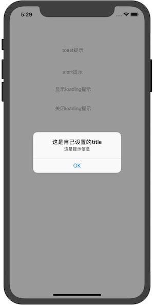

# message
iOS中显示提示
有3种类型：toast, alert, loading
代码120多行代码，完成常用提示功能

# toast


```
toast("这是toast提示，1s钟内自动消失")
```

# alert


```
alert(title: "这是自己设置的title", message: "这是提示信息")
```
# loading


```
//开始loading
let loadingUI = loading(message: "这是loading时的提示语")

//关闭loading
loadingUI.close()
```
